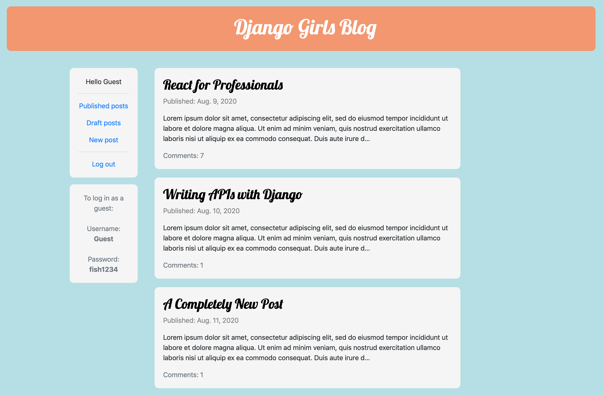
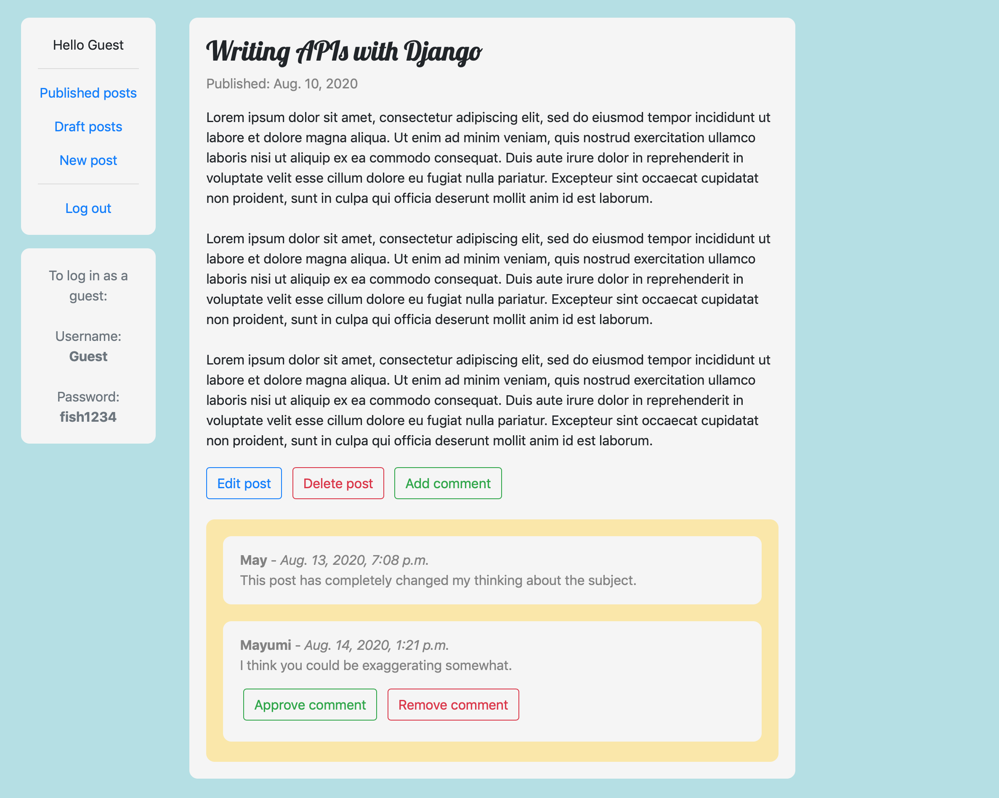

# Django Girls Blog

### Overview

A blog built following the [Django Girls tutorial](https://tutorial.djangogirls.org/en/). 

[Live demo](https://jjl-djangogirlsblog.herokuapp.com)

### Features

Uses a custom Post model including fields for an author (which acts as a foreign key allowing a many-to-one
relationship with the AUTH_USER_MODEL), a post title, post text, a created date, and also a published date
(which enables posts to be classified as either draft posts or published posts). 

Uses more method-based views as opposed to generic class-based views as used in previous projects. Actually,
getting some experience using method-based views was the main reason for doing this tutorial. In particular, 
this gave me the opportunity to have a closer look at how QuerySets work. 

Uses forms for adding and editing blog posts, particularly ModelForm. 

Uses the login_required decorator from django.contrib.auth.decorators to enable user authorization for adding,
editing, publishing, and deleting posts. 

Extends on previous projects by making it possible for users to enter comments from the front end. Also
included functionality enabling the author of a blog post to approve or delete comments made by other readers. 

Uses python-decouple to separate sensitive information from the codebase.

### Built using:

* Python 3.7
* Django 3.0.9
* django-crispy-forms 1.9.2
* Gunicorn 20.0.4
* Whitenoise 5.2.0
* python-decouple 3.3
* Bootstrap 4
* Visual Studio Code 1.48.0
* macOS 10.14.6
* Pipenv
* Heroku
* Git/GitHub

### Screenshots:

List view:
 

Detail view:

